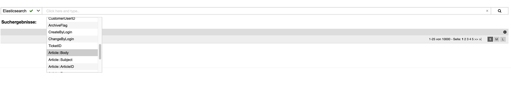

Znuny-SearchFrontend
====================

Znuny-SearchFrontend is a prototype add-on which showcases using the search API.

While it works quite well already, it will be updated as remaining issues are fixed.\
Furthermore, please see the "Future Features" for more details.

Overtime, this package will evolve from a technical demonstration into a full-blown feature.

Requirements
============
- Znuny 6.5+
- [Znuny-Search](https://github.com/znuny/Znuny-Search/) add-on

Functionality
=============

The new frontend has a more modern way to search for configured properties.

Using the newly added menu option "Znuny search", you can easily select specific attributes\
from a dropdown list (as seen below), or just perform a full search by entering the string you'd like to search for.

Click on the magnifying glass to the right to initiate the search.\

The search is then performed against the new search API.

Behind the scenes, ticket IDs are returned from the index then, using the regular\
Znuny API (SQL), the data is collected. This means the actual results are gathered from the database and (currently) not directly shown.

We’ve deliberately chosen this approach and will most likely be modified it in future releases.\
It is already a lot faster - which was the goal.

The initial sort order is by "relevance" in descending order.\
You can change this to age or other attributes.

Future Features
===============

We already know that we want to add more features over the time.

Some of them are:
- More indexes (FAQ, Customer Company, ...) for use by the search frontend
- An "instant-search-mode" using only the results from the index
- A reworked result overview layout for use with "instant-search-mode"
- Template search
- Recent search history
- Export for search results (CSV/Excel)

Vendor
======
This project is part of the Znuny project.\
[Znuny on GitHub](https://github.com/znuny/Znuny/)

If you need professional support or consulting, feel free to contact us.

[Znuny Website](https://www.znuny.com)
